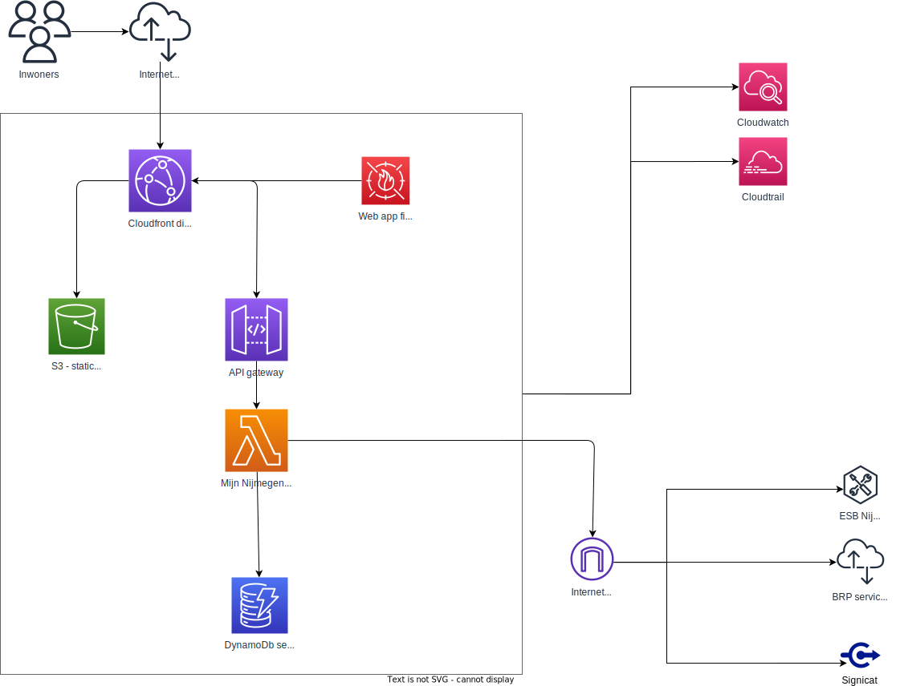

# Opzet Mijn Nijmegen

De applicatie is opgebouwd uit een set Lambda functies die aanroepbaar zijn via een API Gateway die gekoppeld is aan een Cloudfront distributie:



Authenticatie gaat via het OpenIDConnect-protocol, via https://authenticatie.nijmegen.nl. De /login en /auth routes zijn hiervoor verantwoordelijk.

## Installatie
Om de eerste keer te installeren moet een handmatige deploy gedaan worden. Zorg dat je naar de deployment-account deployt. Vanuit daar worden afhankelijk van de gekozen branch in de juiste account resources aangemaakt. Let op dat je environment de juiste branch moet hebben. Daarnaast moet je bij de eerste deploy de arn van de codestarConnection naar Github meegeven. Een voorbeeld:
``` 
export BRANCH_NAME=acceptance
export AWS_PROFILE=deployment
cdk deploy --parameters connectionArn=<arnvancodestarconnection>
```
Vervolgens worden wijzigingen in de verbonden repository in de gekoppelde branche door de pipeline opgepakt.

## Github workflows
Om de workflows (build, selfmutate, upgrade) te kunnen draaien is een token nodig met de naam PROJEN_GITHUB_TOKEN. Zie https://docs.github.com/en/actions/security-guides/automatic-token-authentication#granting-additional-permissions voor meer details.

## Afhankelijkheden
Authenticatie vindt plaats via OpenIDConnect, via [Signicat](https://signicat.com). 

Aan de bestaande API Gateway kunnen nieuwe routes gekoppeld worden in externe projecten. Een voorbeeld is [Mijn Uitkering](https://github.com/gemeenteNijmegen/mijn-uitkering). Dit project is verder afhankelijk van een bestaande DNS Zone in AWS.

## Applicatie-inrichting
De infra-code zit allemaal direct onder /src, in src/app/ is de applicatiecode te vinden. In dit geval de verschillende functies/endpoints. Deze worden in [Mijn Uitkering](https://github.com/gemeenteNijmegen/mijn-uitkering) en [Mijn Gegevens](https://github.com/gemeenteNijmegen/mijn-gegevens) uitgebreid volgens dezelfde systematiek. 

Elk onderdeel dat achter authenticatie zit is op dit moment zelf verantwoordelijk voor de login-check, meestal als volgt als eerste stap in de requestHandler: 
```let session = new Session(cookies, dynamoDBClient);
    await session.init();
    if (session.isLoggedIn() !== true) {
        return redirectResponse('/login');
    }
```
De sessie is nodig om de relevante user op te halen om zijn gegevens te tonen. De sessie-data wordt opgeslagen in dynamodb. De records in deze tabel krijgen een TTL mee, waarna dynamoDB zelf records zal opschonen. Omdat dit niet gegarandeerd direct gebeurt wordt bij het ophalen van de actieve sessie ook een check uitgevoerd of de sessie nog actief is.